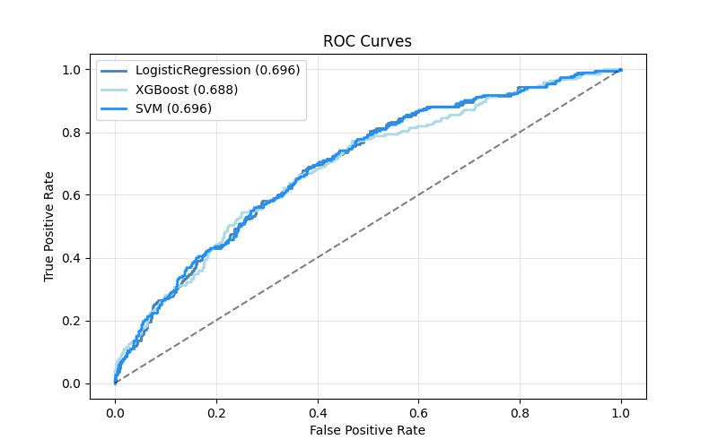
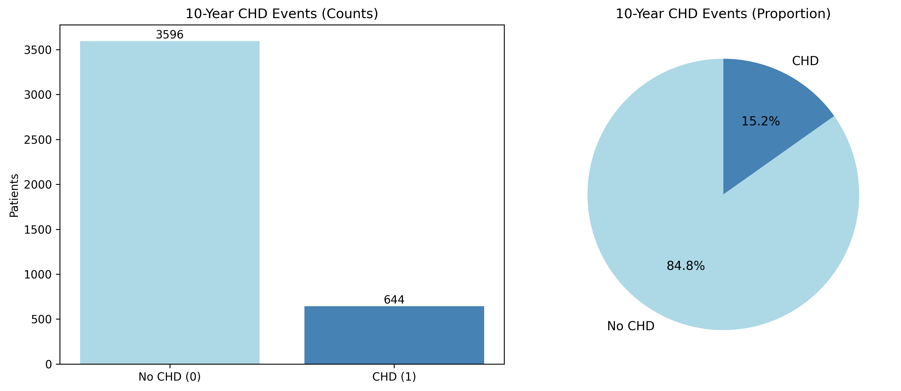

# Framingham Heart Disease Risk Prediction

[](https://python.org)
[](https://scikit-learn.org)
[](https://jupyter.org)

Machine learning pipeline for predicting 10-year coronary heart disease risk using the Framingham Heart Study dataset. Implements advanced preprocessing, class imbalance handling, and threshold optimization for medical diagnosis.

## 🎯 Overview

- **Dataset**: 4,240 patients from Framingham Heart Study
- **Target**: Binary classification (10-year CHD risk)
- **Models**: Logistic Regression, XGBoost, SVM
- **Focus**: High recall optimization for medical screening

## 📊 Key Results

| Model | AUC | Accuracy | Precision | Recall | F1-Score |
|-------|-----|----------|-----------|--------|----------|
| **SVM** | **0.698** | **0.671** | **0.265** | **1.000** | **0.420** |
| XGBoost | 0.672 | 0.663 | 0.259 | 1.000 | 0.412 |
| Logistic Regression | 0.669 | 0.659 | 0.256 | 1.000 | 0.408 |

### Model Performance


### Dataset Distribution


## 🔧 Methodology

1. **Data Preprocessing**: Median imputation, winsorization, robust scaling
2. **Class Imbalance**: SMOTEENN oversampling
3. **Model Selection**: Grid search with 5-fold cross-validation
4. **Threshold Tuning**: Optimized for maximum recall (0.10 threshold)
5. **Fairness Evaluation**: Gender bias analysis

## 🚀 Quick Start

```bash
git clone https://github.com/yassine12-12/framingham-heart-disease-prediction.git
cd framingham-heart-disease-prediction
pip install -r requirements.txt
jupyter notebook framingham_pipeline.ipynb
```

## 📁 Files

- `framingham_pipeline.ipynb` - Main analysis notebook
- `framingham.csv` - Dataset
- `requirements.txt` - Dependencies
- `figures/` - Generated visualizations

## 🏥 Clinical Impact

- **High Sensitivity**: 100% recall for CHD detection
- **Early Screening**: 10% probability threshold for intervention
- **Bias-Free**: No significant gender disparities detected

---

**Dataset Source**: [Framingham Heart Study](https://www.kaggle.com/datasets/aasheesh200/framingham-heart-study-dataset)